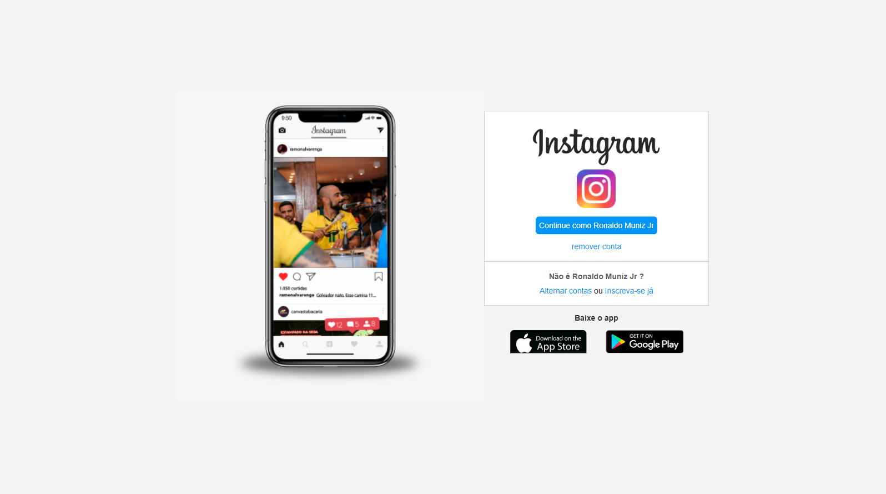

<h1 align="center"> Recriando a pagina de login do instagram </h1>

    

  

  

   

  

  

Este é um projeto realizado pela Digital Innovation One e adaptado por mim, dentro deste projeto foi transpassado lições sobre : HTML5 e CSS3. 

<h2>Principais tópicos abordados</h2>
<ul align="left">
  <li>hierarquia de tags</li>
  <li>flex-layout</li>
  <li>grid-layout</li>
  <li>css tricks</li>
</ul>

